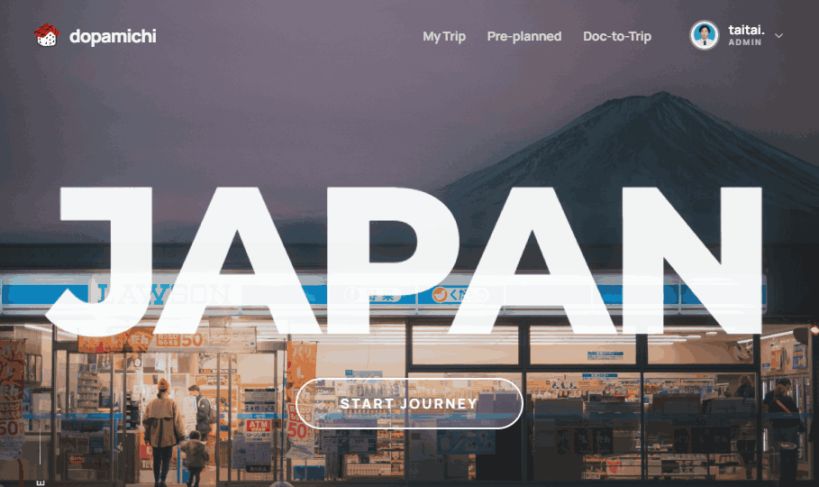
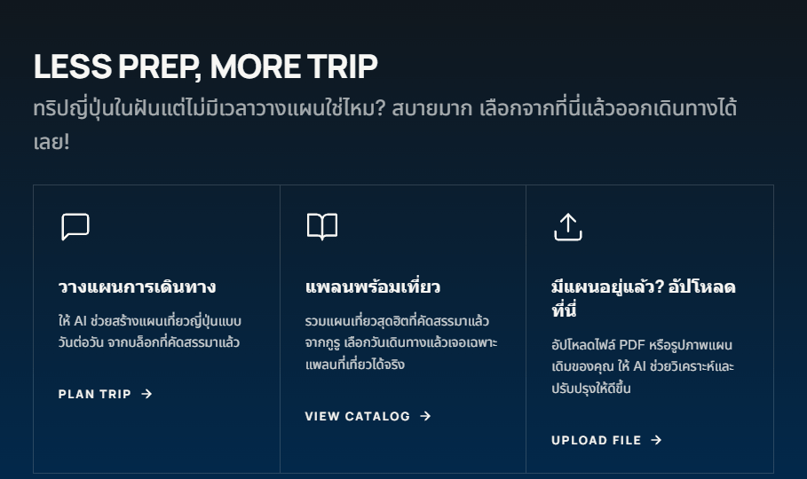

# Handoff: Home Hero + Sticky Navbar Redesign

## Overview
A redesign of the Dopamichi home page hero and the global navbar:

- A **full-bleed photo hero** (Mt. Fuji / convenience-store dusk shot) with a giant
  `JAPAN` wordmark centered over it, a rounded "Start Journey" button, a vertical
  "Learn More" cue bottom-left, and social icons bottom-right.
- A **sticky navbar** that is **transparent while over the hero**, then fades to a
  blurred dark bar once the user scrolls. The **"Home" link is removed** (the logo
  already links to `/`). The sushi logo mark is kept next to the `dopamichi` wordmark.
- The existing **Pathways** card row (3 options) is retained below the hero.

## About the Design Files
The files in this bundle are **design references authored in HTML** (`Dopamichi Hero.dc.html`)
— a prototype showing the intended look and behavior. They are **not** production code to
paste in. The task is to **recreate this design inside the existing `rag-tripbot`
Next.js app**, using its established patterns (App Router, Tailwind v4 theme tokens,
`motion`, `lucide-react`, `next/image`, `next/link`).

> `Dopamichi Hero.dc.html` uses a small runtime (`support.js`) and inline styles just so it
> opens in a browser. Ignore the runtime — read it only to understand layout, spacing, and
> the scroll behavior. Do **not** copy `support.js` or the inline-style approach into the repo.

## Fidelity
**High-fidelity.** Colors, typography, and spacing are final and already match the repo's
tokens. Recreate the UI pixel-faithfully using existing Tailwind classes.

## Target visuals
Reference renders of the intended design:

---

## Target files to change

| File | Change |
| --- | --- |
| `app/page.tsx` | Replace the split-grid hero (`Travel Refined.`) with the full-bleed photo hero + `JAPAN` wordmark. Keep the existing `#pathways` section. |
| `app/components/Navbar.tsx` | Remove the `Home` tab; add scroll-aware transparent→solid styling. Logo/wordmark unchanged. |
| `lib/images.ts` | Add the hero photo entry (`homeHero` already exists — point it at the new dusk shot, or add a new key). |

Everything else (Footer, user menu, mobile dropdown) stays as-is.

---

## Screens / Views

### 1. Hero (`app/page.tsx`, first section)
- **Layout:** `position: relative`, full-viewport (`h-screen`, `min-h-[660px]`),
  `overflow-hidden`. Background photo fills it (`next/image` `fill`, `object-cover`,
  `object-position: center 42%`). A top-to-bottom dark gradient overlay sits above the
  photo for legibility (`z-10`); content sits at `z-15`.
- **Center content** (absolutely positioned, flex column, centered):
  - `JAPAN` — `font-headline` (Manrope) is fine, or Montserrat if you want the exact mock;
    weight 800, white, `text-[clamp(96px,25vw,350px)]`, `leading-[0.9]`,
    `tracking-[-0.03em]`, subtle white text-shadow + `-webkit-text-stroke: 1.4px rgba(255,255,255,.5)`.
    The mock applies `mix-blend-mode: soft-light` on the wordmark (optional).
  - **Start Journey button** — pill (`rounded-full`), `2px` white border,
    `bg-white/25`, uppercase, `tracking-[0.18em]`, `font-headline` bold. Hover →
    `bg-basel-brick border-basel-brick`. Smooth-scrolls to `#pathways`.
- **Bottom-left "Learn More"** — a thin vertical gradient line + vertical uppercase label
  (`writing-mode: vertical-rl; rotate(180deg)`), `rgba(255,255,255,.82)`.
- **Bottom-right socials** — Instagram / Facebook / TikTok icons, `rgba(255,255,255,.85)`,
  hover → `basel-brick`. Use `lucide-react` equivalents or keep inline SVGs.

### 2. Sticky Navbar (`app/components/Navbar.tsx`)
- Currently `fixed top-0 … bg-briefing-cream/80 backdrop-blur-md` — **always opaque cream.**
- New behavior: **transparent over the hero, solid on scroll.**
  - At `scrollY <= 40`: transparent background, **white** logo wordmark + nav links
    (so they read over the dark hero photo).
  - At `scrollY > 40`: `bg-[rgba(20,16,12,0.72)] backdrop-blur-md` (or keep your cream
    variant if you prefer — but the mock uses a dark scrolled bar).
  - Implement with a `useState`/`useEffect` scroll listener setting an `isScrolled` flag,
    then toggle classes. `'use client'` is already at the top of this file.
- **Remove the `Home` tab:** delete `{ id: 'home', label: 'Home', href: '/' }` from `TABS`.
  The logo `<Link href="/">` already covers "go home", so no separate Home link is needed.
- **Logo:** already `IMG.logo` (the sushi mark in `public/`) + `dopamichi` wordmark — **keep as-is.**
  A transparent-background version of the sushi mark is included here (`assets/sushi-logo.png`)
  only in case you need one; **you already have the logo in `public/`, so prefer that.**
- Link labels stay: `My Trip`, `Pre-planned`, `Doc-to-Trip` (+ the disabled `AI Chat`).

### 3. Pathways (unchanged)
Keep the existing `#pathways` 3-card grid from `app/page.tsx` (Chat=maintenance,
Pre-planned, Doc-to-Trip). No visual change required.

---

## Interactions & Behavior
- **Start Journey** + **Learn More**: `e.preventDefault()` then smooth-scroll to `#pathways`.
  Repo already uses `document.getElementById('pathways')?.scrollIntoView({ behavior: 'smooth' })`.
- **Navbar scroll fade**: listen to `window` scroll (`{ passive: true }`), threshold ~40px,
  transition `background` / `backdrop-filter` over ~300ms.
- **Hover states**: nav links white→full-white over hero (or brick when scrolled); button
  fill → `basel-brick`; social icons → `basel-brick`.
- Optional entrance animation with `motion` (repo already imports `motion/react`).

## State Management
- Navbar: one boolean `isScrolled` (client state). No data fetching.
- Hero: none.

## Design Tokens (already in `app/globals.css` — no new tokens needed)
- `--color-basel-brick: #B43325`  → `bg-basel-brick` / `text-basel-brick`
- `--color-briefing-cream: #F8F7F4` → `bg-briefing-cream` / `text-briefing-cream`
- `--color-zen-black: #231a0e` → `text-zen-black`
- `--font-headline: Manrope` → `font-headline`
- `--font-sans: Inter, Noto Sans Thai` → `font-sans`
- Scrolled navbar bar: `rgba(20,16,12,0.72)` + `backdrop-blur-md` (new literal, or add a token).
- Hero legibility overlay: warm brown wash `rgba(35,26,14, α)` (top→bottom, α ramps to ~0.1). **Not** a cool/purple tint.
- Pathways dark section background: Japanese-ink gradient `linear-gradient(180deg,#10171d 0%,#012a4f 100%)` (shikkoku lacquer-black → tetsukon iron-navy), cream text (`briefing-cream`), card hover fill `basel-brick`.

## Assets
- **Hero photo** — `assets/japan-hero.jpg` (Mt. Fuji behind a convenience store at dusk).
  Add to `public/` (or Cloudinary) and reference via `lib/images.ts` (`IMG.homeHero`).
- **Logo** — **already in your `public/` folder** and wired as `IMG.logo`; keep it.
  `assets/sushi-logo.png` here is a transparent-background copy for reference only.
- `assets/avatar.png` — placeholder profile avatar; the real navbar uses the
  authenticated user's `session.user.image`, so ignore this.

## Files in this bundle
- `Dopamichi Hero.dc.html` — the design reference (open in a browser to inspect).
- `screenshots/01-hero.png`, `screenshots/02-pathways.png` — target renders.
- `assets/japan-hero.jpg`, `assets/sushi-logo.png`, `assets/avatar.png` — imagery.
- `support.js` — runtime for the HTML prototype only; **do not port.**

---

## How to apply (Claude Code)
1. Copy this `design_handoff_hero_redesign/` folder into the repo root.
2. In the repo, run Claude Code and say:
   *"Implement the design in `design_handoff_hero_redesign/` — restyle the hero in
   `app/page.tsx` and update `app/components/Navbar.tsx` (remove the Home tab, make the
   nav transparent over the hero and solid on scroll). Use existing tokens/components."*
3. Add `japan-hero.jpg` to `public/` and wire it into `lib/images.ts`.
4. Delete the folder once the change is merged (it's reference material, not app code).
